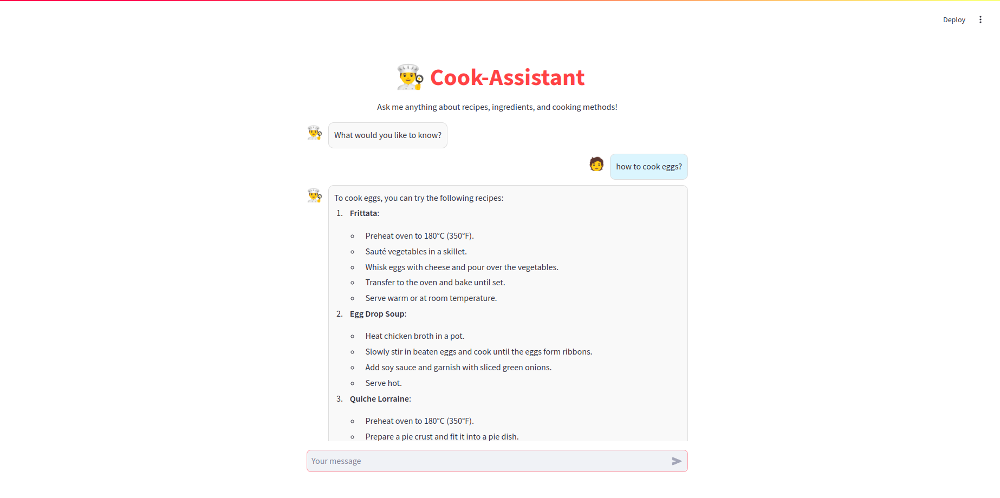
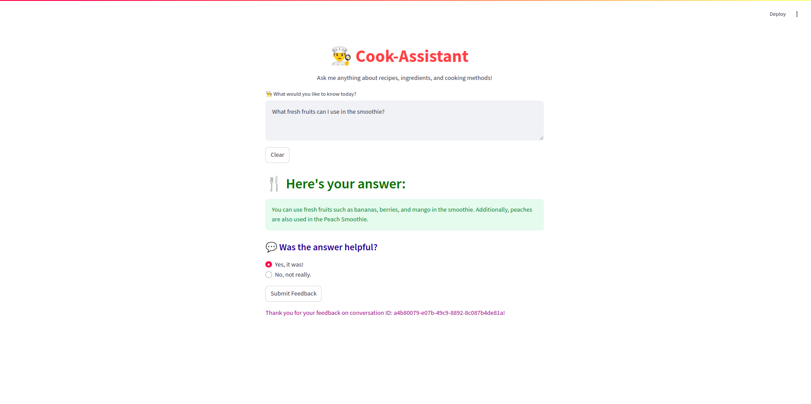
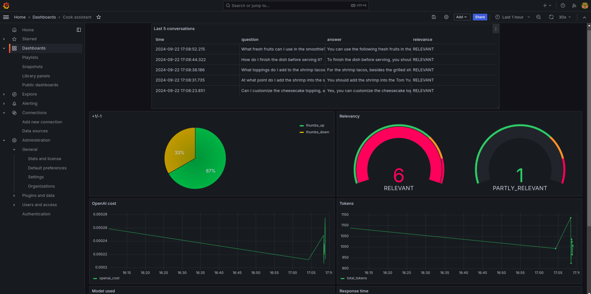

# Cook Assistant - A Recipe RAG Application

<!--  -->
<p align="center">
  
</p>


## Problem Description

Many people find it difficult to get personalized and easy-to-use cooking help. Most platforms are either too complicated or don’t offer enough customization.

Cooking Assistant solves this problem by using a RAG-powered model to provide recipe recommendations, ingredient substitutions, and step-by-step instructions from a dataset of 182 recipes. It offers a simple, interactive solution that makes cooking easier and more efficient.

## Project Overview
Cooking Assistant is a RAG application designed to assist users with their cooking needs.

The main use cases include:

1. **Recipe Selection**: Recommending recipes based on dish type, cuisine, or main ingredients.
2. **Recipe Replacement**: Suggesting alternative recipes or ingredient substitutions.
3. **Cooking Instructions**: Providing step-by-step guidance on how to prepare a dish.
4. **Conversational Interaction**: Offering easy access to recipe information without browsing through websites or cookbooks.
This application simplifies meal preparation by delivering personalized cooking assistance in real-time.

## Dataset

The dataset used in this project conatins comprehensive details about various dishes and is structured in the following format:

| Column Name       | Description                                                                                 |
|-------------------|---------------------------------------------------------------------------------------------|
| `recipe_name`      | The name of the recipe (e.g., *Spaghetti Bolognese*)                                        |
| `type_of_dish`     | The category of the dish (e.g., *Main Course*)                                              |
| `main_ingredient`  | The primary ingredient used in the recipe (e.g., *Beef*)                                    |
| `cuisine`          | The cuisine type of the recipe (e.g., *Italian*)                                            |
| `cooking_method`   | The method used to cook the dish (e.g., *Simmering*)                                        |
| `prep_time`        | The preparation time required (e.g., *10 minutes*)                                          |
| `cook_time`        | The time it takes to cook the dish (e.g., *40 minutes*)                                     |
| `instructions`     | Detailed step-by-step instructions for preparing the dish                                   |

Example of a recipe entry:

```plaintext
recipe_name: Spaghetti Bolognese
type_of_dish: Main Course
main_ingredient: Beef
cuisine: Italian
cooking_method: Simmering
prep_time: 10 minutes
cook_time: 40 minutes
instructions: Heat olive oil in a large pan over medium heat. Add finely chopped onions, carrots, and celery. Cook for 5-7 minutes until softened. Add minced beef and cook until browned. Pour in canned tomatoes, beef broth, and Italian herbs. Simmer uncovered for 30-40 minutes. Stir occasionally and season with salt and pepper. Serve over cooked spaghetti and garnish with fresh basil.
```

The dataset was generated using ChatGPT and contain 182 records. It serves as the foundataion for the Cook Assistant's recipes recommendataions and instructional support.

You can find in [`data/data.csv`](data/data.csv)

## Technologies

* Python 3.12 - Core programming language.
* Docker & Docker Compose - For containerization and service orchestration.
* [Minisearch](https://github.com/alexeygrigorev/minisearch) - Full-text search engine.
* OpenAI - Leveraged for large language model (LLM) capabilities.
* Flask & Streamlit - API and user interface (more details in the [Background](#background)).
* Grafana - Monitoring and visualization tool.
* PostgreSQL - Backend database integrated with Grafana for data storage and management.


## Preparation

1. Set Up OpenAI API Key

    Since this project uses OpenAI, you'll need to provide an API key.

    Install direnv to manage environment variables. For Ubuntu users, run:
    ```bash
    sudo apt update

    sudo apt install direnv
    ```

    Then, add the following line to your .bashrc:
    ```bash
    direnv hook bash >> ~/.bashrc
    ```

2. Copy the `.envrc_template` file to a new file named `.envrc`:
    ```bash
    cp .envrc_template .envrc
    ```

3. Insert your OpenAI API key into the `.envrc` file. (It's recommended to create a new OpenAI project and generate a separate key for this application.)


4. Run the following command to load the key into your environment:

    ```bash
    direnv allow
    ```

Next, install `pipenv` to manage your Python environments.

```bash
pip install pipenv
```

Once installed, you can install the app dependencies:

```bash
pipenv install --dev
```

## Running the application

### Database Configuration

Before starting the application for the first time, the database needs to be initialized.

1. Start the PostgreSQL service by running:
    ```bash
    docker-compose up postgres
    ```

2. Next, run the `init_database.py` script to initialize the database and dashboard:
    ```bash
    pipenv run python init_database.py
    ```

3. To check the contents of the database, you can use pgcli (which is already installed with pipenv):
    ```bash
    pipenv run pgcli -h localhost -U your_username -d cook_assistant -W
    ```

4. You can view the schema by using the `\d` command within `pgcli`:
    ```bash
    \d conversations;
    ```

5. To query the data in the table, run:
    ```bash
    select * from conversations;
    ```

## Running it with Docker Compose

The easiest way to run this application is with `docker compose`:

```bash
docker compose up
```

## Running locally

To run the application locally, start only PostgreSQL and Grafana with the following command:
```bash
docker compose up postgres grafana
```

If you previously launched all applications using `docker-compose up`, you'll need to stop the running apps first:
```bash
docker compose stop flask-app streamlit-app
```

To get started app on your host machine, first activate your environment and navigate to the `src` directory:
```bash
pipenv shell

cd src
```

To run the `Flask` app, execute the following command:
```bash
python flask_app.py
```


To launch the `Streamlit` chat app, use this command:
```bash
streamlit run streamlit_app.py
```

You can see streamlit chat app at: [`localhost:8501`](http://localhost:8501)

<p align="center">
  
</p>

## Running with Docker (without compose)

Sometimes you might want to run the application in Docker without Docker Compose, e.g., for debugging purposes if you need to change something in the dockerfile and test it quickly.

First, prepare the environment by running Docker Compose as in the previous section.

Next, build the image:

```bash
docker build -t cooking-assistant .
```

And run it:

```bash
docker run -it --rm \
    --network="llm-rag-project_default" \
    --env-file=".env" \
    -e OPENAI_API_KEY=${OPENAI_API_KEY} \
    -e DATA_PATH="data/data.csv" \
    -p 5000:5000 \
    cooking-assistant
```

## Using the application

When the application is running, we can start using it.

### CLI

We built an interactive CLI application using [questionary](https://questionary.readthedocs.io/en/stable/).

To start it, run:

```bash
pipenv run python demo_cli.py
```

You can also make it randomly select a question from our [ground truth dataset](data/ground-truth-retrieval.csv):

```bash
pipenv run python demo_cli.py --random
```

### Using `requests`:

When the application is running, you can use [requests](https://requests.readthedocs.io/en/latest/) to send questions—use [test.py](test.py) for testing it:

```bash
pipenv run python test.py
```

### CURL

You can also use `curl` for interacting with the API:

When it's running, let's test it:

```bash
URL=http://localhost:5000
QUESTION="What should I do after cooking the onions, carrots, and celery?"
DATA='{
    "question": "'${QUESTION}'"
}'

curl -X POST \
    -H "Content-Type: application/json" \
    -d "${DATA}" \
    ${URL}/question
```

You will see something like the following in the response:

```json
{
"answer": "After pouring the filling over the crust for the Lemon Bars, you should bake them until set, which typically takes about 30 minutes.", 
"conversation_id": "9b99ab97-ddd4-4bf7-b759-7b1b1a9b93bc", 
"question": "After pouring the filling over the crust, how long should I bake the bars until they are set?"
}
```

Sending feedback:

```bash
ID="62a747fd-d748-4d1c-813f-4575ab4e8d96"
URL=http://localhost:5000
FEEDBACK_DATA='{
    "conversation_id": "'${ID}'",
    "feedback": 1
}'

curl -X POST \
    -H "Content-Type: application/json" \
    -d "${FEEDBACK_DATA}" \
    ${URL}/feedback
```

After sending it, you'll receive the acknowledgement:

```json
{
  "message": "Feedback received for conversation 62a747fd-d748-4d1c-813f-4575ab4e8d96: 1"
}
```

### Streamlit Demo

To get started the simple `Streamlit` demo, use the following command:
```bash
pipenv shell

streamlit run demo_streamlit.py
```

Your app will be accessible at [`localhost:8501`](http://localhost:8501).

<p align="center">
  
</p>

## Code Structure

The codebase is organized into various modules, each with a specific role in the application. Below is an overview of the key files and their functionality.

### Source Code (`src` folder)

* `flask_app.py`: The main entry point of the Flask API, responsible for serving the backend of the application.

* `streamlit_app.py`: The Chat UI for the application, built using Streamlit, providing an interactive interface.

* `rag.py`: Contains the RAG (Retriever-Augmented Generation) logic used for retrieving data and constructing prompts for the application.

* `ingest.py`: Handles the process of loading data into the knowledge base, crucial for populating the backend data.

* `minsearch.py`: An in-memory search engine that enables efficient and fast data retrieval from the knowledge base.

* `db.py`: Includes the logic for logging requests and responses to a PostgreSQL database, ensuring proper tracking of interactions.

* `db_prep.py`: A script used for initializing the PostgreSQL database, preparing it for data storage.

### Root Directory Files

* `test.py`: A utility script for selecting random questions, used for testing the application's logic and performance.

* `demo_cli.py`: Provides an interactive Command-Line Interface (CLI) for interacting with the application.

* `demo_streamlit.py`: The simple UI for the application, built using Streamlit.

* `init_database.py`: Prefect flow for initializing the PostgreSQL database.

* `init_dashboard`: Prefect flow for setting up the Grafana dashboard.
## Interface

We utilize Flask to serve the application as an API, and Streamlit for building the user interface (UI).
Refer to the ["Running the Application"](#running-the-application) section for examples on interacting with both the API and UI.

Streamlit provides a more interactive interface for users to access the application's functionalities through a user-friendly web interface. This is managed via streamlit_app.py.

## Ingestion

The ingestion logic is handled in [`ingest.py`](src/ingest.py).
Since the application uses minsearch, an in-memory database for the knowledge base, the ingestion script runs automatically at startup when [`rag.py`](src/rag.py) is imported.


## Experiments

We use Jupyter notebooks for conducting experiments, which are located in the notebooks folder.

To start Jupyter, run the following commands:

```bash
cd notebooks
pipenv run jupyter notebook
```

The available notebooks include:

* [`data-preparation.ipynb`](notebooks/data-preparation.ipynb): Cleans the data generated from ChatGPT and prepares it for further use.
* [`rag-test.ipynb`](notebooks/rag-test.ipynb): Demonstrates the RAG flow and evaluates the system's performance.
* [`evaluation-data-generation.ipynb`](notebooks/evaluation-data-generation.ipynb): Generates the ground truth dataset for retrieval evaluation.
* [`hybrid-search`](notebooks/hybrid-search.ipynb): Explores and tests hybrid search methods to assess their performance and efficiency.


## Retrieval Evaluation

The initial approach using minisearch without any boosting yielded the following metrics:

* Hit Rate: 86%
* Mean Reciprocal Rank (MRR): 71%

With enhancements through improved boosting, the metrics were:

* Hit Rate: 87%
* MRR: 74%

The optimal boosting parameters were determined using [`hyperopt`](https://hyperopt.github.io/hyperopt/)   and are as follows:

```python
boost = {
    'exercise_name': 2.31984897428916,
    'type_of_activity': 1.4242161164765066,
    'type_of_equipment': 0.8557405139948276,
    'body_part': 0.1592615373833831,
    'type': 1.7674132568449183,
    'muscle_groups_activated': 2.8318029512403116,
    'instructions': 0.018866767130518602
    }
```

We also tested hybrid search, which resulted in:

* Hit Rate: 83%
* MRR: 74%

After applying reranking with Reciprocal Rank Fusion (RRF), the metrics improved to:

* Hit Rate: 85%
* MRR: 75%

Given that the performance was comparable across these methods, we opted to continue using `minisearch`.

## RAG flow Evaluation

We used the LLM-as-a-Judge metric to evaluate the quality of our RAG flow

For gtp-4o-mini, among 910 records, we had:

* 807 (88%) RELEVANT
* 91 (10%) PARTLY_RELEVANT
* 12 (1%) IRRELEVANT

## Monitoring

We use Grafana for monitoring the application.

It's accessible at [`localhost:3000`](http://localhost:3000):

* Login: "admin"
* Password: "admin"

### Dashboards

<p align="center">
  
</p>

The monitoring dashboard contains several panels:

1. Last 5 Conversations (Table): Displays a table showing the five most recent conversations, including details such as the question, answer, relevance, and timestamp. This panel helps monitor recent interactions with users.
2. +1/-1 (Pie Chart): A pie chart that visualizes the feedback from users, showing the count of positive (thumbs up) and negative (thumbs down) feedback received. This panel helps track user satisfaction.
3. Relevancy (Gauge): A gauge chart representing the relevance of the responses provided during conversations. The chart categorizes relevance and indicates thresholds using different colors to highlight varying levels of response quality.
4. OpenAI Cost (Time Series): A time series line chart depicting the cost associated with OpenAI usage over time. This panel helps monitor and analyze the expenditure linked to the AI model's usage.
5. Tokens (Time Series): Another time series chart that tracks the number of tokens used in conversations over time. This helps to understand the usage patterns and the volume of data processed.
6. Model Used (Bar Chart): A bar chart displaying the count of conversations based on the different models used. This panel provides insights into which AI models are most frequently used.
7. Response Time (Time Series): A time series chart showing the response time of conversations over time. This panel is useful for identifying performance issues and ensuring the system's responsiveness.

### Setting up Grafana

All Grafana configurations are in the grafana folder:

* `init.py` - for initializing the datasource and the dashboard.
* `dashboard.json` - the actual dashboard (taken from LLM Zoomcamp without changes).

To initialize the dashboard, first ensure Grafana is running (it starts automatically when you do docker-compose up).

Then run:
```bash
pipenv run python init_dashboard.py
```

Then go to [`localhost:3000`](http://localhost:3000):

* Login: "admin"
* Password: "admin"

When prompted, keep "admin" as the new password.

## Background

Here we provide background on some tech not used in the course and links for further reading.

### Flask

We use Flask for creating the API interface for our application. It's a web application framework for Python: we can easily create an endpoint for asking questions and use web clients (like curl or requests) for communicating with it.

In our case, we can send questions to http://localhost:5000/question.

For more information, visit the official [`Flask documentation`](https://flask.palletsprojects.com/en/3.0.x/).

### Prefect

In addition, we utilize Prefect for orchestrating our workflows. Prefect allows us to define, schedule, and monitor data pipelines, ensuring that our tasks run reliably and efficiently. It provides a user-friendly interface for managing workflows and handling task dependencies.

For more details, check out the official [`Prefect documentation`](https://docs.prefect.io/3.0/get-started/index).


## Acknowledgements

This project was made possible by the insights and skills gained from [LLM-Zoomcamp](https://github.com/DataTalksClub/llm-zoomcamp) and the concept of Retriever-Augmented Generation (RAG). A special thanks to the LLM-Zoomcamp team for their valuable resources and guidance on working with large language models and RAG techniques.

## References

* [llm-zoomcamp](https://github.com/DataTalksClub/llm-zoomcamp)
* [fitness-assistant](https://github.com/alexeygrigorev/fitness-assistant)